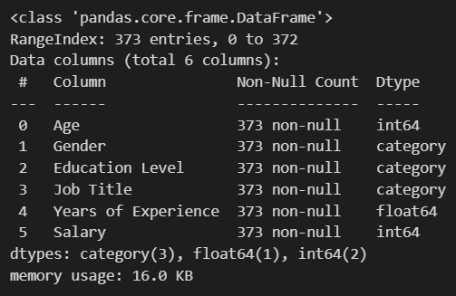
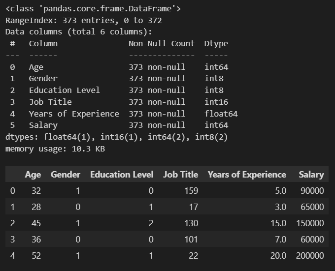
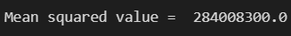

# Implementation-of-Decision-Tree-Regressor-Model-for-Predicting-the-Salary-of-the-Employee

## AIM:
To write a program to implement the Decision Tree Regressor Model for Predicting the Salary of the Employee.

## Equipments Required:
1. Hardware – PCs
2. Anaconda – Python 3.7 Installation / Jupyter notebook

3. 
## Algorithm:

1. Import the required libraries .
2. Read the data frame using pandas.
3. Get the information regarding the null values present in the dataframe.
4. Apply label encoder to the non-numerical column inoreder to convert into numerical values.
5. Determine training and test data set.
6. Apply decision tree regression on to the dataframe.
7. Get the values of Mean square error, r2 and data prediction.


## Program:
### Program to implement the Decision Tree Regressor Model for Predicting the Salary of the Employee.
```py
# Developed by: YUVARAJ.S
# RegisterNumber: 22008589
import pandas as pd
import numpy as np
data=pd.read_csv("Salary Data.csv")
data.head()
data.tail()
data.info()
data["Gender"]=data["Gender"].astype('category')
data["Education Level"]=data["Education Level"].astype('category')
data["Job Title"]=data["Job Title"].astype('category')
data.info()
data["Gender"]=data["Gender"].cat.codes
data["Education Level"]=data["Education Level"].cat.codes
data["Job Title"]=data["Job Title"].cat.codes
data.info()
data.head()
x=data[['Age','Gender','Education Level','Job Title','Years of Experience']]
x
x.shape
y=data[['Salary']]
y.shape
from sklearn.model_selection import train_test_split
x_train, x_test, y_train, y_test = train_test_split(x, y, test_size=0.2, random_state=2)
from sklearn.tree import DecisionTreeRegressor
dtr=DecisionTreeRegressor()
dtr.fit(x_train,y_train)
y_pred=dtr.predict(x_test)
print(y_pred)
x_train.shape
from sklearn import metrics
mse=metrics.mean_squared_error(y_test,y_pred)
mse
r2=metrics.r2_score(y_test,y_pred)
r2
dtr.predict([[44,0,2,130,20]])
```

## Output:
### Read CSV Head File :

### Tail :

### Dataset Info :





### X Data :

### X Data Shape :

### Y Pred :

### Mean Squared Value :

### R2 Value :

### dtr Predict :

## Result:
Thus the program to implement the Decision Tree Regressor Model for Predicting the Salary of the Employee is written and verified using python programming.
